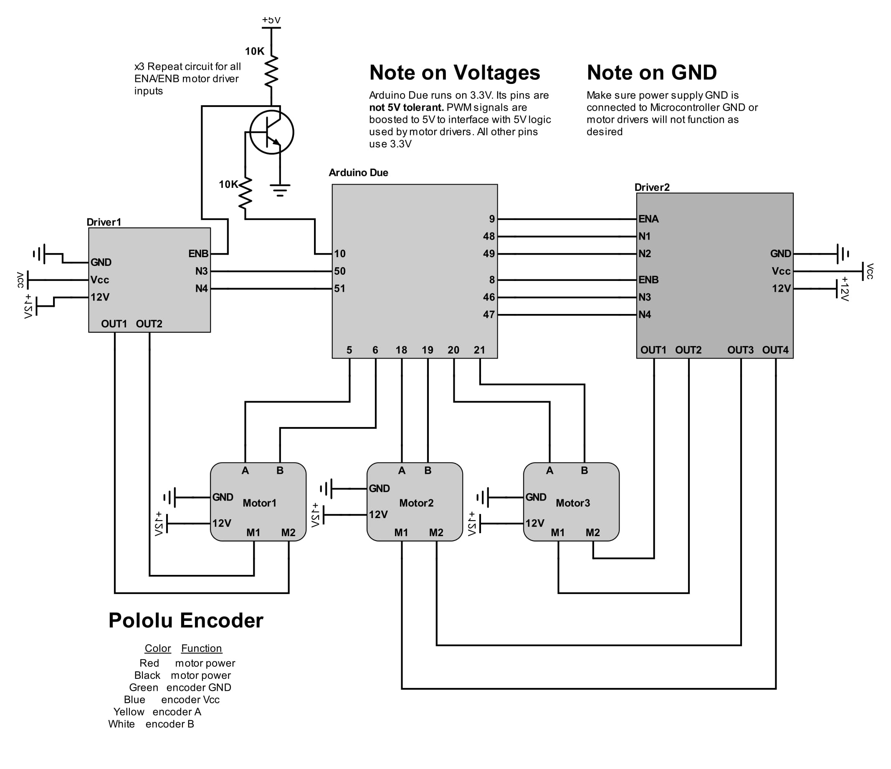

# Arduino Code

### Table of Contents

* [Overview and Setup](#terrain-treadmill)
* [Nodes](../src#nodes)
* [Launch Files](./launch#launch-files)
* [Arduino Code](#arduino-code)
	* [Main](#main)
	* [Libraries](#libraries)
	    * [ROS Interface Library](#ros-interface-library)
	    * [Motor Control Library](#motor-control-library)
	    	* [Encoder](#encoder)
	    	* [Controller](#controller)
	    	* [Motors](#motors)
	    	* [Utilities](#utilities)
	    	* [Timer](#timer)

## Main

[terrain_treadmill.ino](./terrain_treadmill/terrain_treadmill.ino) is the main sketch running on the Arduino. It sets up ROS Communication, initializes the motor controllers, and receives/sends desired/actual motor velocities to ROS.

## Libraries

### ROS Interface Library
[ros_lib](./Libraries/ros_lib) contains the files required to use [rosserial](http://wiki.ros.org/rosserial) to communicate with the Arduino. If you're having trouble getting the sketch to compile after following the instructions in [Hardware setup](), try reinstalling ros_lib in your Arduino sketchbook by sourcing your workspace and then [Instal ros_lib into the Arduino Environment](http://wiki.ros.org/rosserial_arduino/Tutorials/Arduino%20IDE%20Setup). NOTE, when using this library with an Arduino Due, manually change `Serial1` to `Serial` in [ArduinoHardware.h](./Libraries/ros_lib/ArduinoHardware.h#L68) or the Arduino will not connect with ROS.

### Motor Control Library
[pid_lib](./Libraries/pid_lib) is a custom C library for velocity control of 3 DC motors with encoders using PID control. The library files are organized as follows. For more information on an individual file, check the comments. This library can easily be adapted to use more/less motors or different hardware.

#### Encoder

[Encoder.cpp](./Libraries/pid_lib/Encoder.cpp), [Encoder.h](./Libraries/pid_lib/Encoder.h)

These files contain the functions which are used to interpret the quadrature encoder waveforms to determine motor position and velocity. The encoder signals cause rising-edge interrupts on the Arduino. The [interrupt service routines](./Libraries/pid_lib/Encoder.cpp#L216-L298) then add/subtract counts to the position totals. For this implementation, the full resolution of the encoder is not utilized in interest of simplifying the computational cost. Therefore, the total encoder resolution should be divided by four to obtain the actual resolution. The [filtered_velocity](./Libraries/pid_lib/Encoder.cpp#L193-L214) function uses a moving average of size n (set in [terrain_treadmill.ino](./terrain_treadmill/terrain_treadmill.ino#L22)) to get a less noisy estimate of the velocity at any time.  

#### Controller

[Controller.cpp](./Libraries/pid_lib/Controller.cpp), [Controller.h](./Libraries/pid_lib/Controller.h)

These files contain the fixed frequency PID controller used to control the motors to match their desired velocities. A [timer based interrpt](./Libraries/pid_lib/Controller.cpp#L26) is used to trigger the controller to update motor voltages at a fixed frequency. The actual positions/velocities are [read](./Libraries/pid_lib/Controller.cpp#L46-L48) by the controller and [compared](./Libraries/pid_lib/Controller.cpp#L50-L52) to the desired values. Then, the controller determines the [desired effort](./Libraries/pid_lib/Controller.cpp#L142-L146) based on the error between the two. If the effort is negative, the motor direction is [flipped](./Libraries/pid_lib/Controller.cpp#L166-L174). Max control effort corresponds with a [full byte](./Libraries/pid_lib/Controller.cpp#L177-L180) (255).

#### Motors

[Motors.cpp](./Libraries/pid_lib/Motors.cpp), [Motors.h](./Libraries/pid_lib/Motors.h)

These files contain the necessary functions for interfacing with the motor drivers. If you are using a different motor driver, update the [motor_setup](./Libraries/pid_lib/Motors.cpp#L17-L39), [setPWM](./Libraries/pid_lib/Motors.cpp#L42-L62), and [motor_direction](./Libraries/pid_lib/Motors.cpp#L65-L105) functions as necessary.

#### Utilities

[Utilities.cpp](./Libraries/pid_lib/Utilities.cpp), [Utilities.h](./Libraries/pid_lib/Utilities.h)

These files contain the operating mode for the motor controllers. The only relevant operating mode for this project is VELOCITY_HOLD which turns on the velocity PID controller.

#### Timer

[DueTimer.cpp](./Libraries/pid_lib/DueTimer.cpp)/[DueTimer.h](./Libraries/pid_lib/DueTimer.h)

Contains code which implements timer-based interrupts for Arduino Due. This library was written by [ivanseidel](https://github.com/ivanseidel/DueTimer). Libraries for Arduino Uno/Mega can be found [here](https://playground.arduino.cc/Code/Timer1).
