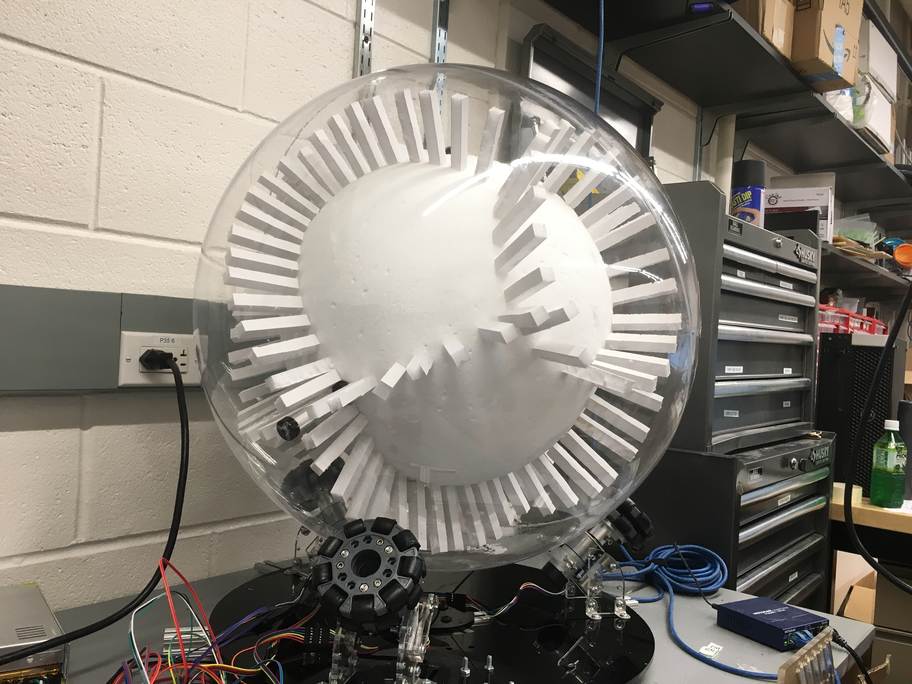
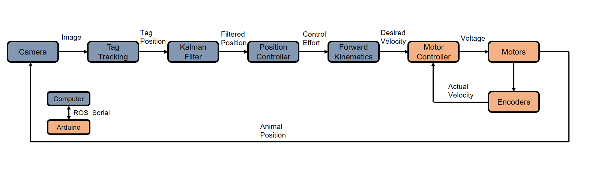
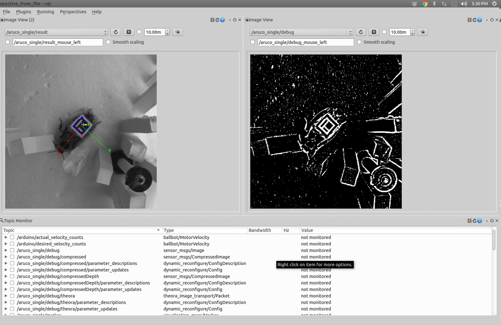
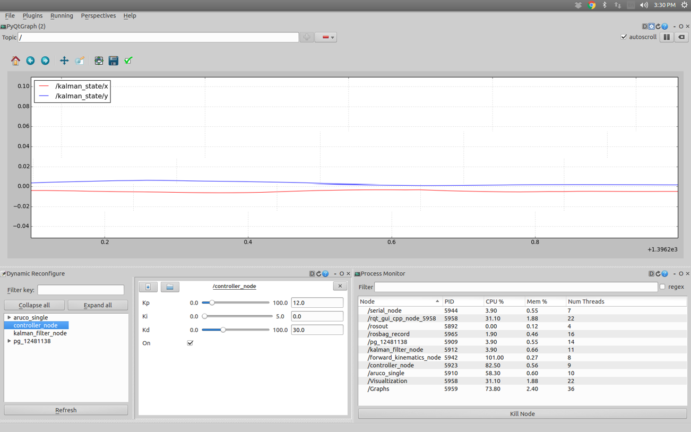

# Terrain Treadmill
This repository contains code being used to run the complex terrain treadmill in the [Terradynamics Lab](https://li.me.jhu.edu/) at Johns Hopkins University.

## Project Description
The purpose of this project was to develop a novel terrain treadmill to study Animal-Terrain Interaction During Locomotion in Complex Environments. This device allows for detailed study of cockroach dynamics and behavior over over large spatiotemporal scales.

### Table of Contents

* [Overview and Setup](#terrain-treadmill)
    * [Device Overview](#device-overview)
	* [Installation Instructions](#installation-instructions)
	* [Running the Device](#running-the-device)
	* [Device Tuning](#device-tuning)
  * [Data Analysis](#data-analysis)
	* [Maintenance](#maintenance)
	* [Parts List](#parts-list)
* [Nodes](./src#nodes)
* [Launch Files](./launch#launch-files)
* [Arduino Code](./Arduino#arduino-code)

## Device Overview

The terrain treadmill consists of two concentric spheres rigidly attached together. The animal moves through interchangeable terrain modules mounted on the inner sphere, and the transparent outer sphere allows its position to be tracked in real time. This information is then used to actuate the spheres via close-loop control, so that they rotate in the opposite direction in order to keep the animal on top.

The device uses a computer running ROS Indigo for image processing, filtering, and control. An Arduino is used to control the motors which actuate the device. To learn more about the ROS nodes being used to control the device, see the [node](./src) section. To learn more about the Arduino code, see the [Arduino](./Arduino) section.

## Installation Instructions
### ROS Package Install

First, make sure that ROS is installed and that you have a properly configured catkin [workspace](http://wiki.ros.org/catkin/Tutorials/create_a_workspace). Clone this project into your workspace using:
* `git clone git@github.com:TerradynamicsLab/terrain_treadmill.git`

This repository also has several dependencies on packages not yet released on `apt-get`. Install these packages using the same method as above:
* [aruco_ros](https://github.com/pal-robotics/aruco_ros): minimum version required 0.2.2
* [camera_base](https://github.com/KumarRobotics/camera_base)
* [flea3](https://github.com/KumarRobotics/flea3)

The remaining dependencies are listed in [CMakeLists.txt](./CMakeLists.txt) and can be installed normally using `apt-get`. Source the workspace `source devel/setup.bash` and make the package `catkin_make` to build the project.

### Hardware setup
An [Arduino Due](https://store.arduino.cc/usa/arduino-due) is used to interface with the three [DC Motors](https://www.pololu.com/product/2826) used to actuate the device. A circuit diagram for the project can be found [here](./images/Circuit.pdf). This repository contains the necessary libraries to compile to main [terrain_treadmill.ino](./Arduino/terrain_treadmill/terrain_treadmill.ino) sketch and upload it to the Arduino. Copy the [pid_lib](./Arduino/Libraries/pid_lib) and [ros_lib](./Arduino/Libraries/ros_lib) (generated using [rosserial](http://wiki.ros.org/rosserial)) libraries into your Arduino libraries folder. Then compile and upload `terrain_treadmill.ino` onto the device.

* Note: if you have trouble compiling the Arduino Code, see the Arduino [readme](./Arduino).

## Running the Device
To start the device, navigate to your workspace, source the correct environment variables, and launch [start.launch](./launch/start.launch)
* `cd [catkin_ws]`
* `source devel/setup.bash`
* `roslaunch terrain_treadmill start.launch`

This will start the device with the default settings. [Rqt](http://wiki.ros.org/rqt) is used for real-time data analysis and debugging.

Various properties can be altered by specifying arguments at runtime. For example:
* `roslaunch terrain_treadmill start.launch record:=true`: records specified topics into a .bag file which is saved in the ~/.ros directory
* `roslaunch terrain_treadmill start.launch visualization:=false light_visualizations:=true`: starts the project in light visualization mode which hides debugging information

For more options, see [launch](./launch).

## Device Tuning

Several aspects of the device must be tuned in order to achieve optimum performance. These include:
* Low-Level Motor Controllers:
The Arduino uses three [PID Controllers](https://en.wikipedia.org/wiki/PID_controller) to match the desired velocity sent to the Arduino from the computer. These controllers are tuned to track the desired velocity as closely as possible while maintaining desired response characteristics (low overshoot, quick settling time, etc.). The [motor_test_node.py](./src/motor_test_node.py) node can be used to aid in the tuning of these controllers. See the [node readme](./src) for more information.

* Kalman Filter Gains:
A constant velocity model [kalman filter](https://en.wikipedia.org/wiki/Kalman_filter) is used to estimate the animal position when the tracking data becomes temporarily unavailable. Several aspects of the filter must be tuned for optimal performance. For this project, the most relevant parameter is the process covariance which can be tuned using dynamic reconfigure. For more information on the kalman filter, see the [node readme](./src).

* High-Level Controller:
A PID position controller is used to determine the desired control effort as a result of the animal's deviation from the center of the image frame. The PID gains from this controller can be tuned using dynamic reconfigure. For more information on this controller, see the [node readme](./src).

* Camera parameters:
Various camera parameters must be tuned in order to obtain good images for tracking. Camera placement, focus, lens size, and aperture are all hardware adjustments for this setup. Additionally, there are several parameters which can be adjusted in [flea3.launch](./launch/flea3.launch). These parameters can be tuned using dynamic reconfigure and then saved using the launch file.

  * Frame-rate: dictates how quickly the camera captures images. Note, higher frame rates do not necessarily result in better performance if Aruco tag detection cannot analyze images quickly enough. It is recommended to match the frame-rate to the frequency of Aruco tag detection at a given resolution.

  * Resolution: dictates the computational cost for Aruco tag detection. The smallest resolution that satisfies the other requirements is recommended. Aruco tag detection can be performed at ~50 Hz using a 688 x 700 image.

  * Shutter-Time: dictates how long shutter stays open for each image capture. Keep shutter-time low to reduce motion blur and improve tag detection. For this setup, a 5 ms shutter time produces good results.

  * For more information on tuning camera parameters, see [Guide to photography](https://i.redd.it/tq0zowda2shz.jpg).

  * Before use, the camera will also need to be calibrated to account for distortion. For information on how to calibrate the camera, see the [launch readme](./launch).

* Aruco Tracking Parameters:
[Aruco](https://www.uco.es/investiga/grupos/ava/node/26) is a tracking library which uses VR tags to determine tag locations in real-world coordinates. [Pal Robotics ROS implementation](https://github.com/pal-robotics/aruco_ros) of the library is used for this project. Assuming the camera parameters are set properly, there are several Aruco parameters which also must be adjusted for optimal performance. First, the markerID and size must be properly set in [aruco_marker_finder.launch](./launch/aruco_marker_finder.launch). The threshold parameters can then be adjusted using dynamic reconfigure. To permanently save adjustments, change the default values within your aruco_ros ArucoThreshold.cfg file. Note: this file is not located in the terrain_treadmill package.

## Data Analysis
Data can be recorded in a [rosbag](http://wiki.ros.org/rosbag) by running `roslaunch terrain_treadmill start.launch record:=true.` This results in a rosbag file containing being stored in your `~/.ros` directory. This bag can be played back for analysis. For more information on using rosbag to play back data, see [here](http://wiki.ros.org/rosbag/Commandline#play). Videos recorded in rosbag files can also be exported in your desired format. For information on exporting rosbag videos, see [here](http://wiki.ros.org/rosbag/Tutorials/Exporting%20image%20and%20video%20data). Rosbag files can also be imported directly to MATLAB using the [Robotics Systems Toolbox](https://www.mathworks.com/help/robotics/index.html). This package contains custom messages which will need to be imported to MATLAB using the [rosgenmsg](https://www.mathworks.com/help/robotics/ref/rosgenmsg.html) function which requires the [Robotics System Toolbox Interface for ROS Custom Messages](https://www.mathworks.com/matlabcentral/fileexchange/49810-robotics-system-toolbox-interface-for-ros-custom-messages).

## Maintenance
Acrylic hemispheres quickly build up finger prints, scuff marks, small scratches, and tape residue during normal use. DO NOT clean acrylic with regular towels. Use microfiber clothes to avoid scratching the surface. Use [acrylic cleaner](https://www.amazon.com/NOVUS-7100-Plastic-Polish-Kit/dp/B002UCYRZU) to help remove finger prints, dirt, and small scratches. Use [WD-40](https://www.amazon.com/WD-40-Multi-Use-Product-Multi-Purpose-Lubricant/dp/B0083V8H0I/ref=sr_1_1?s=automotive&ie=UTF8&qid=1504127919&sr=1-1&keywords=wd-40) to aid in the removal of tape residue.

## Parts List
* 1x [Arduino Due](https://store.arduino.cc/usa/arduino-due)
* 3x [DC Motor + Encoder](https://www.pololu.com/product/2826)
* 3x [DC Motor Driver](https://www.amazon.com/SainSmart-Stepper-Controller-Mega2560-Duemilanove/dp/B00AJGM37I)
* 1x [12V Power Supply](https://www.amazon.com/eTopxizu-Universal-Regulated-Switching-Computer/dp/B00D7CWSCG)
* 2x 24" Optically Clear Acrylic Hemisphere
* 1x 16" Styrofoam Ball
* 1x Tapped Plastic Rod + 2x screws
* 1x [Pointgrey Flea3 Camera](https://www.ptgrey.com/flea3-usb3-vision-cameras)
* 1x [16 mm lens](http://www.fujifilmusa.com/products/optical_devices/machine-vision/1-15-mp/cf16ha-1/)
